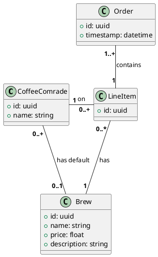

can apple apps be side loaded

how difficult is it to publish an apple app? without having a dev account yet

markdown table with injected newlines in row

python string format vs f string

# ongoing prompt:
Given this SQL relationships, generate seed data 

* 5 comrades
* a standard coffee menu for brews
* 10 orders following this format. each of the 5 comrades with a brew, usually their default but occasional random new brew off menu 

generate this in three separate json files

---

overall, the seed data looks good. but strip out the ids and timestamps in each file.
also the orders data is not quite right. for each order, add 5 line items - one for each comrade

# ongoing context

    brews = []
    comrades = []
    orders = []
    with open('./seedData/brews.json', 'r') as file:
        data = json.load(file)
        for b in data:
            brews.append(Brew(b["name"], b["price"], b["description"]))
            print(brews[-1])

> dupliate the same logic for comrades and orders array as the brews array. use names to reference existing objects